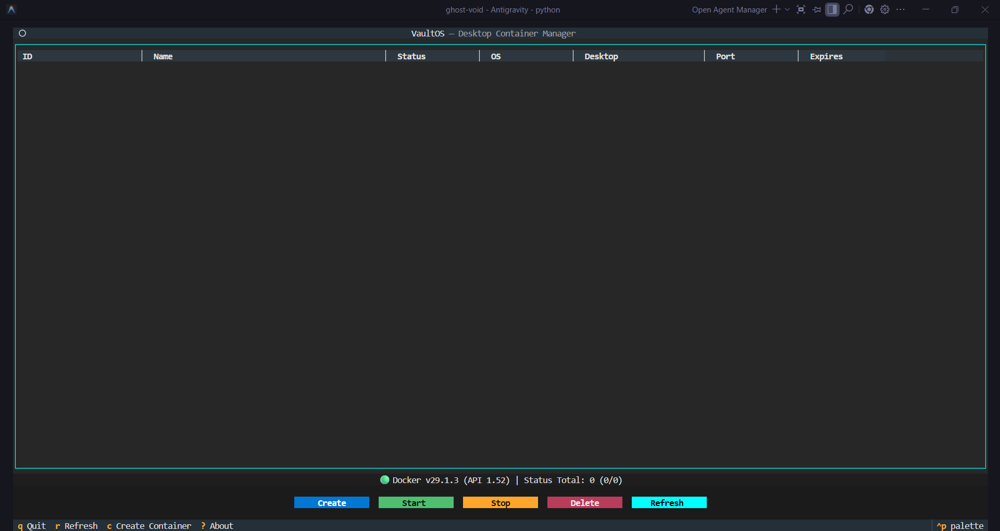
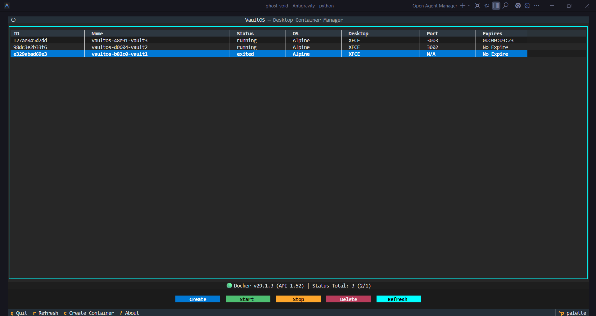
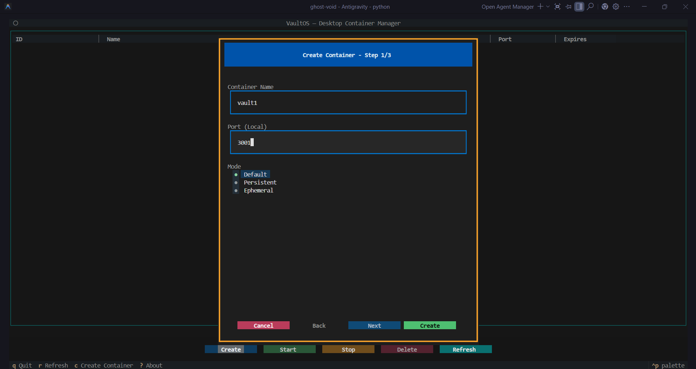
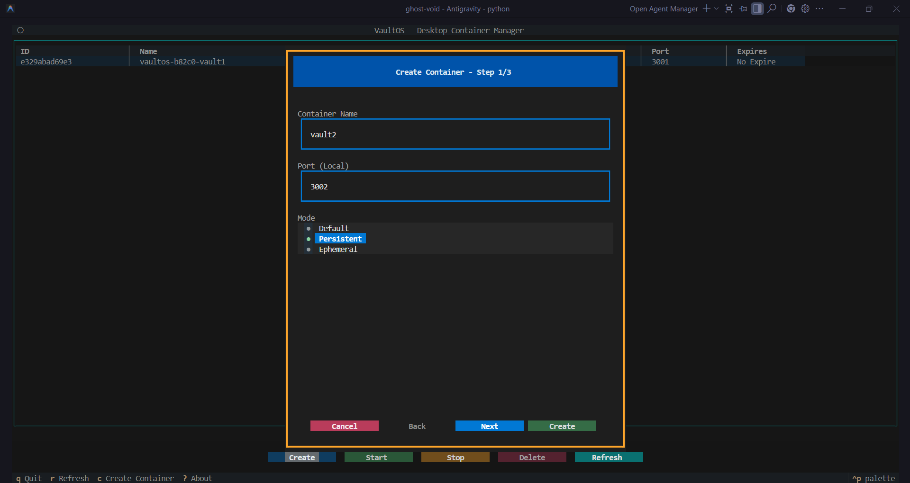
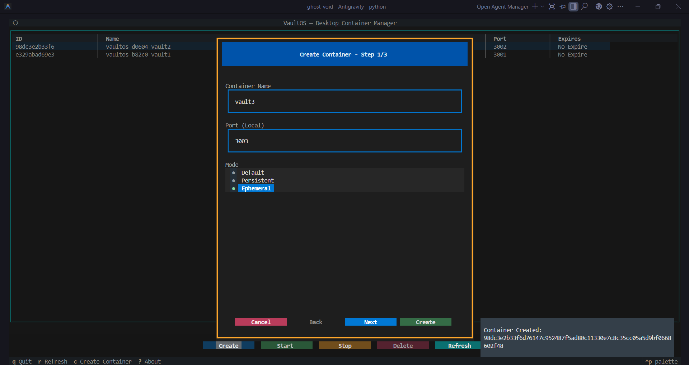
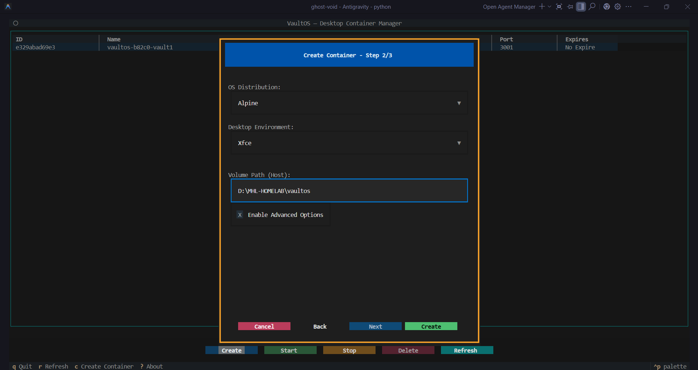
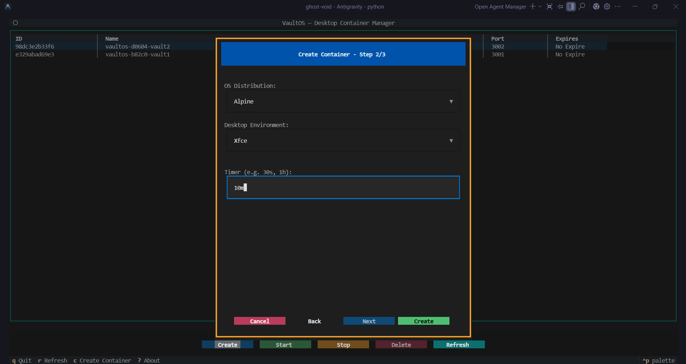
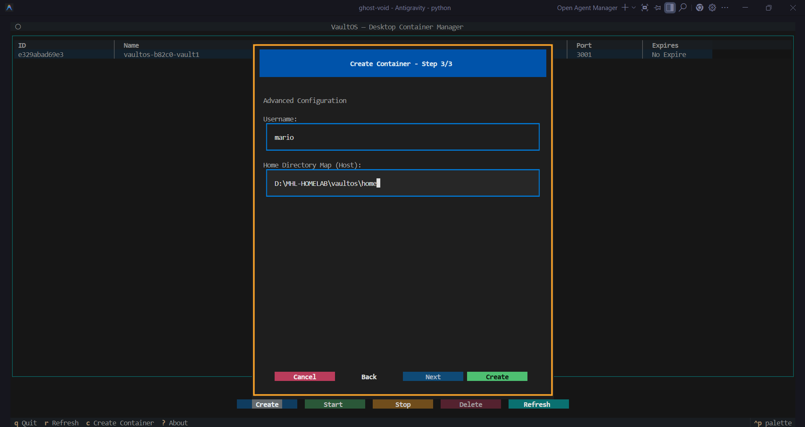

# VaultOS Screenshots & Visual Guide

## Dashboard Views

### Main Dashboard
The primary interface of VaultOS. 
- **Grid Layout**: Shows a responsive table of active containers.
- **Columns**: Displays Container ID, Name, Status, OS Distribution, Desktop Environment, Host Port, and Expiration Timer.
- **Status Bar**: Provides real-time feedback on Docker connection status (`🟢 Connected`), Engine API version, and a summary of Total/Running/Stopped containers.
- **Toolbar**: Quick access buttons for creation and lifecycle management (`Create`, `Start`, `Stop`, `Delete`, `Refresh`).

---

## Container Creation Wizard

### Step 1: Mode Selection

#### Default Mode
The standard, quick-start configuration.
- **Name**: User defines a simple identifier (e.g., `dev-box`).
- **Port**: Maps to a local host port (default `3001`).
- **Mode Selected**: `Default` is chosen for a standardized, ephemeral Alpine/XFCE container.

#### Persistent Mode
For environments that require data retention.
- **Mode Selected**: `Persistent`.
- **Volume Path**: A host path is provided (e.g., `C:/data/config`) to ensure `/config` data survives container restarts.
- **Advanced Options**: The checkbox "Enable Advanced Options" is visible, allowing further customization in Step 3.

#### Ephemeral Mode
For temporary, disposable workspaces.
- **Mode Selected**: `Ephemeral`.
- **Timer Input**: A timer field appears (e.g., `30s`, `2h`) to set the lifespan of the container.

### Step 2: Distribution & Desktop
Selecting the environment flavor.
- **OS Distribution**: A dropdown allows selection of base Linux distros (Alpine, Ubuntu, Arch, Fedora, etc.).
- **Desktop Environment**: Context-aware dropdown to choose the desktop interface (XFCE, KDE, MATE, i3).

### Step 3: Advanced Configuration
Only available in Persistent mode with "Advanced Options" checked.
- **Custom User**: Allows replacing the default `abc` user with a custom username (e.g., `danish`).
- **Home Mapping**: Maps a host directory to the custom user's home (e.g., `/data/home` -> `/home/danish`), ensuring full user persistence and correct permissions.

---

## Desktop Access

### In-Browser Session (`browser.png`)
Once the container is running:
- **WebTop Interface**: Access the full Linux GUI directly from your browser (e.g., Chrome, Firefox).
- **Features**: Includes clipboard sharing, sound support (depending on image), and responsive resizing.
- **URL**: Accessible at `http://localhost:<PORT>`.

